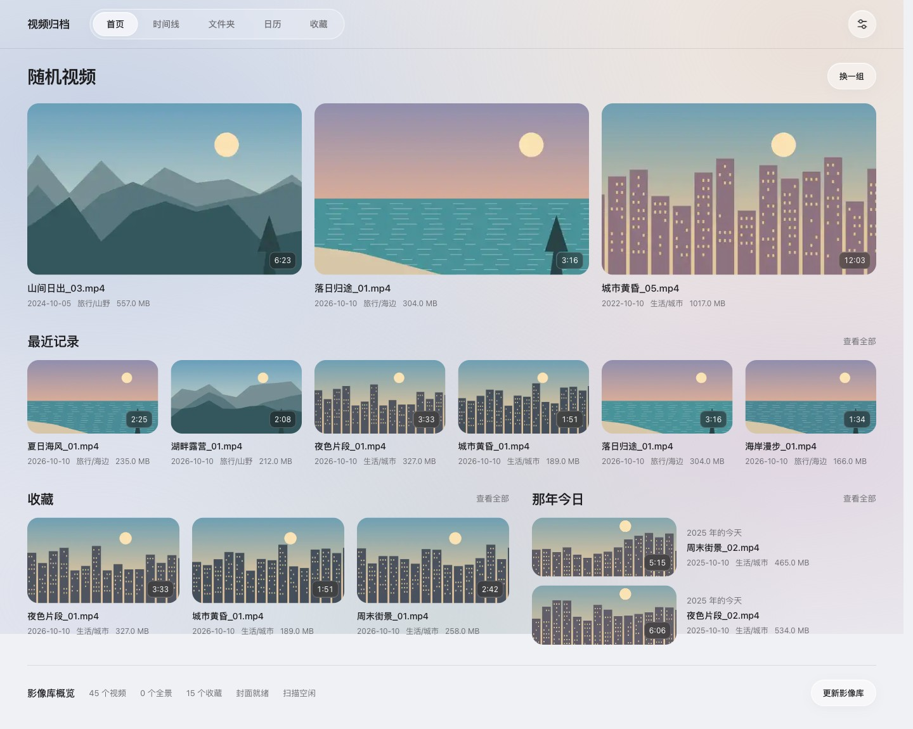
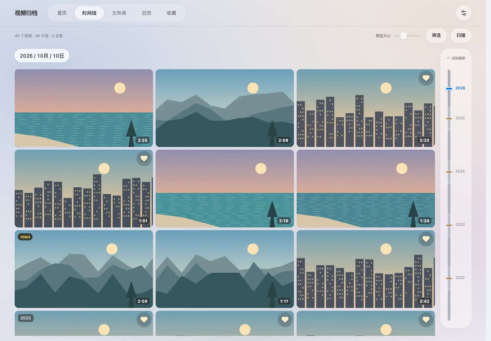
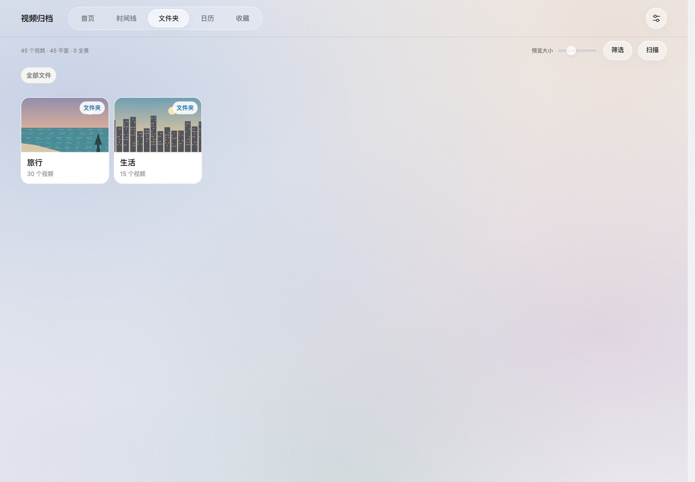
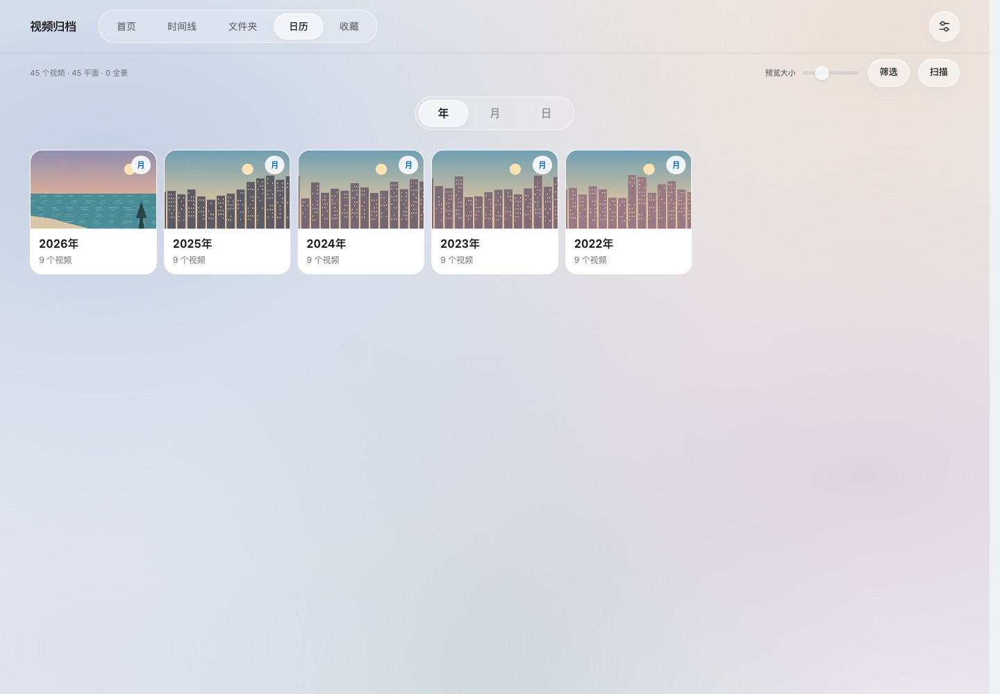
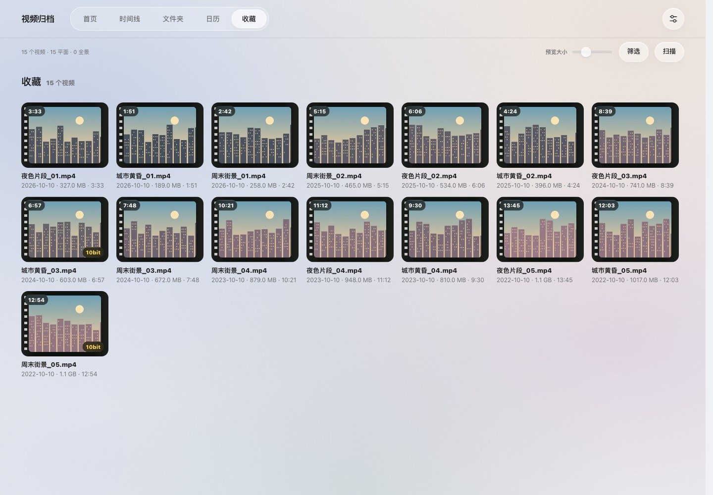
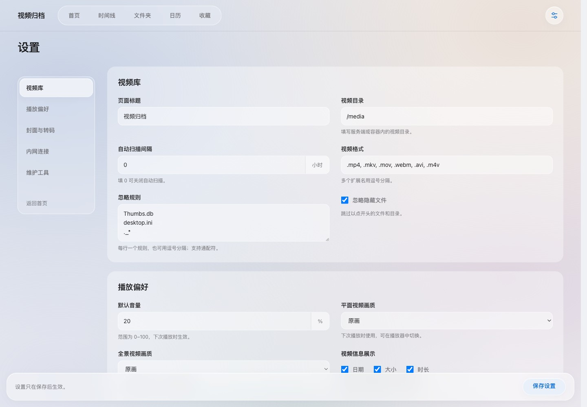
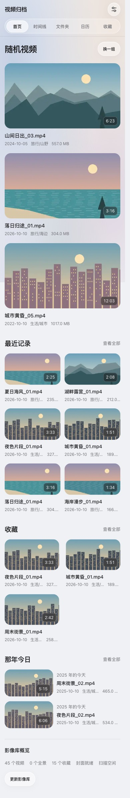

# VideoRecBack

VideoRecBack 是面向 NAS 视频存档的容器化浏览器，支持时间线、文件夹、日历、收藏、平面与全景播放。视频列表从 SQLite 读取，封面使用 WebP 缓存，浏览首页和视频库时不遍历原视频目录。

当前版本：**2.6.13**。从 [最新版 Release](https://github.com/JDui/VideoRecBack-Docker/releases/latest) 下载 Docker 镜像包，或从源码构建。

## 页面展示

以下截图来自 2.6.13 的实际页面，使用独立示例数据库与绘制的示意封面，不包含真实用户视频或路径。桌面视口为 1440 × 1000，手机视口为 390 × 844；首页截图展示完整页面，其他桌面截图展示首屏。

### 首页

随机拾回三段视频，同时查看最近记录、收藏、那年今日和影像库概览。



### 时间线

按文件时间浏览视频，侧边密度时间轴支持拖动、键盘和跨批次跳转。



### 文件夹与日历

| 文件夹：按目录查找 | 日历：从年份逐级进入月份和日期 |
| --- | --- |
|  |  |

### 收藏与设置

| 收藏：集中查看珍藏片段 | 设置：分组导航与固定保存栏 |
| --- | --- |
|  |  |

<details>
<summary>查看手机首页</summary>



</details>

## 快速安装

### 1. 下载并加载镜像

在 [v2.6.13 Release](https://github.com/JDui/VideoRecBack-Docker/releases/tag/v2.6.13) 下载 `videorecback-2.6.13-amd64.tar`。发布包适用于 **linux/amd64**，ARM NAS 请按下方说明从源码构建对应架构的镜像。

```bash
docker load -i videorecback-2.6.13-amd64.tar
```

Release 同时提供 `SHA256SUMS`，可在保存这两个文件的目录中校验：

```bash
sha256sum -c SHA256SUMS
```

### 2. 创建 Docker Compose 配置

将以下内容保存为 `compose.yaml`，把 `/path/to/nas/videos` 改为 NAS 上的实际视频目录：

```yaml
services:
  videorecback:
    image: videorecback:2.6.13
    container_name: videorecback
    ports:
      - "8080:8080"
    volumes:
      - ./config:/config
      - ./data:/data
      - /path/to/nas/videos:/media:ro
    restart: unless-stopped
```

```bash
docker compose up -d
```

打开 `http://<NAS 地址>:8080`，进入设置确认目标路径为 **`/media`**，然后点击扫描。目标路径填写容器内路径；扫描在后台处理，可通过页面查看进度。

### 从源码构建

```bash
git clone https://github.com/JDui/VideoRecBack-Docker.git
cd VideoRecBack-Docker
git checkout v2.6.13
docker build -t videorecback:2.6.13 .
docker compose up -d
```

先按上述模板创建 `compose.yaml`。本机构建默认使用 Docker 主机架构；需要跨架构构建时，可用 `docker buildx build --platform linux/amd64 --load -t videorecback:2.6.13 .`。

## 升级与数据目录

升级前备份 `config` 和 `data` 目录，加载新镜像后更新 Compose 中的镜像版本，执行 `docker compose up -d`。保留原有挂载即可沿用设置、视频索引、收藏和排除记录；旧数据库字段会自动迁移。

| 容器路径 | 用途 |
| --- | --- |
| `/config` | `settings.json`，保存目标目录、播放偏好、扫描与内网设置 |
| `/data` | SQLite 数据库、WebP 封面与播放/下载缓存 |
| `/media` | 只读挂载的原视频目录；也可使用其他容器内路径并在设置中修改 |

扫描会读取原视频目录并更新索引。发现文件被删除时，会移除对应数据库记录、封面及串流缓存。

## 主要功能

### 浏览与回忆

- 首页包含随机三个视频、最近记录、收藏、那年今日和影像库概览。随机支持换组；最近记录按文件时间排序，那年今日匹配往年同月同日的文件时间。
- 首页、时间线、文件夹、日历、收藏使用统一导航。视频库支持按类型、时长、画幅筛选，切换视图保留筛选条件，可调整封面预览大小。
- 时间线按 180 条分批加载，时间轴基于完整筛选索引，以每日视频数量的平方根分配长度；支持拖动、方向键、Home/End 和跨批次跳转。
- 平面封面使用四个时间点合成 WebP 四宫格，全景封面使用鱼眼球面预览；可选择 480P、576P 或 720P 封面高度。10bit 视频显示标记，带全景标记或接近 2:1 的视频默认识别为全景。
- 封面失败数量可点击查看文件名、路径与失败原因，支持分页和重试。

### 播放与下载

- 点击封面即可播放。页面宽高比大于 4:3 时在右侧展开内嵌播放器，默认占可用宽度的 2/3；可拖动分隔条或用键盘调节，Home 或双击恢复默认比例。其他画幅进入完整播放页，关闭后恢复列表位置。
- 可分别设置平面/全景默认画质，并设置默认音量；播放器可收藏视频、切换画质、全屏和调节播放。全景支持拖动、触控板滑动与缩放、触屏双指缩放。
- 10bit 原画在浏览器无法直接播放时自动切到超清 HLS；播放卡住时尝试恢复当前时间点。HLS 暂停或页面短暂隐藏不会立即删除当前转码流。
- 下载菜单可独立选择画质：原画直接下载源文件，其他画质先生成完整 MP4，再保存到浏览器；生成后的文件复用缓存。播放和下载接口支持 HTTP Range。

| 画质 | 播放方式 | 转码配置 |
| --- | --- | --- |
| 原画 | 原始媒体直接推流 | 不转码 |
| 超清 | HLS 分片串流 | 保持原分辨率，8 Mbps |
| 高清 | HLS 分片串流 | 最高 1080P，3 Mbps |
| 流畅 | HLS 分片串流 | 最高 720P，1 Mbps |

### 视频操作

- 时间线右键或长按可进入视频设置，或选择“不参与随机与每日”；排除后仍保留在视频库，可从同一菜单恢复参与。
- 首页随机视频菜单支持“跳转到时间线位置”和“不再出现在随机中”，后者仅影响随机推荐。
- 收藏页右键或长按可跳转时间线或进入视频设置。菜单支持 Shift+F10、方向键和 Escape，排除设置持久保存在数据库中。

### 扫描与维护

- 手动扫描在后台执行，完成后保留视图、筛选和时间线位置；内嵌播放器打开时延后刷新，关闭后更新列表。
- 自动扫描间隔按小时设置，设为 `0` 可关闭。只有扫描、增量文件/文件夹处理和播放/下载媒体请求读取原视频，普通页面浏览读取数据库与封面缓存。
- 全盘扫描批量比较路径、文件大小与纳秒时间，未变化文件不写数据库。媒体分析与封面生成使用单并发后台队列，限制 FFmpeg 线程数，并对失败任务限制重试。
- 设置页按视频库、播放偏好、封面与转码、内网连接、维护工具分组，保存后留在当前页面。可调整标题、视频扩展名、忽略规则、元数据显示、HLS 编码器和缓存上限。
- 维护工具提供封面刷新、全景重校验、全部视频数据重校验和 2 MB 服务器连通测试；数据重校验会重新记录 10bit、色度采样和平均码率。

### 界面与兼容

使用低饱和彩色渐变、磨砂半透明导航与菜单，页面切换显示对应布局的加载骨架。支持手机与矮屏布局、减少动态效果、减少透明度和高对比度偏好；不支持背景模糊的浏览器使用实色控件。

## 内网直连与自动跳转

设置页“内网连接”可配置服务地址、端口与协议，并开启内网直连检测。浏览器自动探测服务；受浏览器安全策略限制时，可点击“检测内网”，通过一次性顶层导航握手确认连接，再使用“跳转内网”。

“载入前自动跳转内网”对应 `/config/settings.json` 中的 `intranet_auto_redirect_enabled`，默认 `false`，需同时开启直连检测并填写服务地址。开启后，首页、视频库、设置及播放页面先检测内网，成功后保留路径、查询参数和锚点跳转；失败或超过 1.5 秒继续加载当前地址。已经使用内网地址时不会重复跳转。

## 本地开发与验证

需要 Python 3.12+ 和可用的 `ffmpeg`、`ffprobe`；Docker 镜像已包含媒体工具。

```bash
python -m venv .venv
source .venv/bin/activate
pip install -r requirements-dev.txt
APP_CONFIG_DIR=./config APP_DATA_DIR=./data uvicorn app.main:app --host 127.0.0.1 --port 8080
```

运行回归测试：

```bash
python -m pytest -q
node --test tests/*.test.cjs
```

全景封面调试：

```bash
python -m app.thumbnails /path/to/panorama360.mp4 /tmp/thumb.webp --duration 120
```

该命令输出取帧时间、封面尺寸、亮度/对比度、有效性及重试原因。

## 相关文档

- [视频操作、下载与全屏验证](docs/design/video-actions-qa.md)
- [界面、加载与时间轴验证](docs/design/liquid-glass-qa.md)
- [Rust 性能优化路线](docs/rust-performance.md)

也可以把本项目链接发给你的 AI agent，请它按 NAS 视频目录生成 Docker Compose 配置并启动容器。
